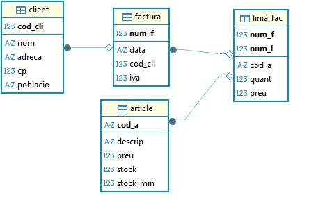
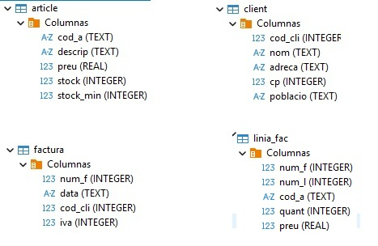
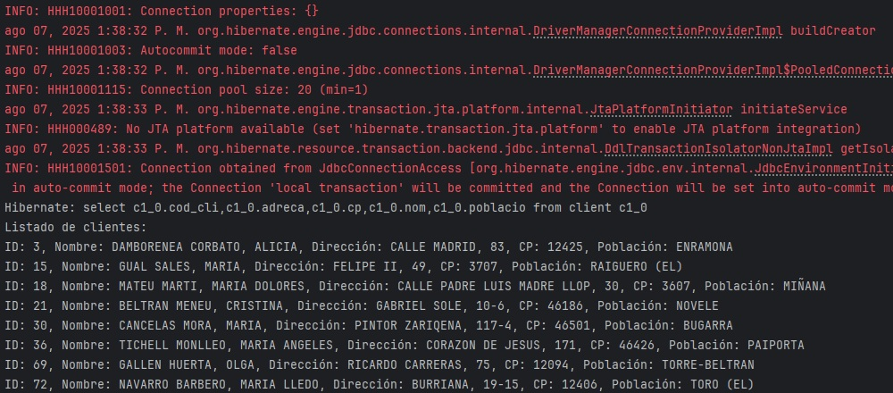

# Hibernate

En el desarrollo de aplicaciones que usan bases de datos relacionales, las herramientas ORM (**Object-Relational Mapping**) permiten **gestionar la persistencia de objetos** sin tener que escribir SQL manualmente.

**Hibernate** es una **implementación directa de JPA**, que permite persistir objetos Java/Kotlin. Se utiliza mucho en proyectos donde se desea controlar cada detalle del proceso de persistencia.

En este apartado veremos como configurar un proyecto en IntelliJ con **Hibernate + Kotlin + Gradle**, tanto para una BD embebida **SQlite** como para una BD en servidor **Postgres**.

En ambos proyectos **necesitamos**:

- Kotlin (IntelliJ 2024)
- Base de datos SQLite /Postgres
- Librerías Hibernate y JDBC en build.gradle.kts
- Clases con anotaciones JPA
- Un archivo de configuración hibernate.cfg.xml
- Un dialecto personalizado para el caso de SQLite

!!!Note "Dialecto"
    Hibernate necesita un **dialecto** para saber cómo debe comunicarse con cada tipo de base de datos.
    Como **SQLite** no tiene uno propio incluido, debemos crearlo nosotros para decirle cómo funcionan sus comandos y tipos.
    Sin ese dialecto, Hibernate no sabrá cómo generar las sentencias SQL correctas y fallará al conectarse o ejecutar consultas.

## Mecanismos de persistencia  de Hibernate

Hibernate nos ayuda a **guardar y recuperar objetos Java en una base de datos** sin que tengamos que escribir mucho SQL.  
Para conseguirlo utiliza varios mecanismos:

---

**1- Sesión o contexto de persistencia**{.azul}

- **Qué es:** Piensa en la sesión como una “mochila” donde Hibernate guarda temporalmente los objetos con los que estás trabajando.  
- **Qué hace:** Si cambias un objeto (por ejemplo, el nombre de un cliente), Hibernate se da cuenta y, al final de la transacción, actualiza la base de datos automáticamente.  
- **Caché de primer nivel:** Dentro de esa mochila está el “primer caché”: si ya pediste un cliente, no volverá a la base de datos mientras dure la sesión.
- **UPDATE único**:  Si cambias varias propiedades, Hibernate las agrupa en un único UPDATE al final de la transacción.

> **Ejemplo:**  
> Pides el cliente con id 5, lo guardas en memoria, cambias su nombre, y cuando confirmas la transacción Hibernate actualiza ese cambio en la base.

---

**2- Ciclo de vida de los objetos en Hibernate**{.azul}

Los objetos que usas en Hibernate pueden encontrarse en diferentes estados, dependiendo de si están relacionados o no con la base de datos y la sesión activa:

- **Transitorio (Transient):** El objeto ha sido creado con `new` pero *no está guardado en la base ni asociado a la sesión*. No tiene identificador y Hibernate no lo rastrea. Ejemplo: `new Cliente()`.
- **Persistente o gestionado (Persistent o Managed):** El objeto está asociado a la sesión y cualquier cambio que le hagas será sincronizado automáticamente con la base de datos al confirmar la transacción. Ejemplo: cargaste o guardaste un objeto usando la sesión.
- **Separado (Detached):** El objeto representó un registro guardado, pero su sesión se cerró. Sigue existiendo en memoria, pero Hibernate ya no rastrea cambios en él a menos que se reuna con una sesión.
- **Eliminado (Removed):** El objeto está marcado para borrar de la base de datos cuando se confirme la transacción.

**3- Transacciones**{.azul}

- **Qué es:** Una transacción es un paquete de operaciones que **o se hacen todas o no se hace ninguna**.  
- **Qué hace Hibernate:** Coordina estas transacciones con la base de datos para que los datos queden siempre correctos.

> **Ejemplo:**  
> Si le restas stock a un producto y sumas esa venta, ambas acciones deben hacerse juntas.  
> Si una falla, se deshacen todas.

---

**4- Mapeo Objeto-Relacional (ORM)**{.azul}

- **Qué es:** El proceso de decirle a Hibernate cómo un objeto Java se relaciona con una tabla y sus columnas en la base de datos.  
- Lo hacemos con **anotaciones** (`@Entity`, `@OneToMany`, etc.) o con XML.  
- Permite también indicar relaciones entre objetos (uno a muchos, muchos a muchos, etc.).

---

**5- Lenguajes de consulta**{.azul}

- **HQL:** Parecido a SQL, pero pensado para trabajar con **objetos y atributos** en vez de con tablas y columnas.
- **Criteria API:** Consultas en Java usando métodos y objetos → ideal para construir consultas dinámicas.
- **SQL nativo:** Si hace falta, puedes usar consultas SQL normales.

---
**6- Gestión de concurrencia**{.azul} 

- **Qué es:** Hibernate evita que dos usuarios modifiquen el mismo dato al mismo tiempo sin darse cuenta.
- Usa principalmente **control optimista**, con un campo de “versión” para detectar cambios simultáneos.

---

**7- Caché de segundo nivel**{.azul} 

- **Qué es:** Un almacenamiento opcional **compartido entre sesiones** para no repetir lecturas a la base de datos.
- **Para qué sirve:** Acelerar aplicaciones que leen mucho y escriben poco.

---

**8- Lazy Loading (Carga perezosa)**{.azul} 

- **Qué es:** No traer datos de relaciones hasta que realmente los necesites.
- **Para qué sirve:** Evita pedir datos innecesarios y mejora el rendimiento.

> **Ejemplo:**  
> Cargas un cliente y solo su información básica; sus pedidos no se cargan hasta que llamas a `cliente.getPedidos()`.

---

**9- Interceptores y eventos**{.azul}

- **Qué es:** Puntos donde puedes “enganchar” tu código y ejecutar algo antes o después de que Hibernate guarde, actualice o borre.

> **Ejemplo:** Registrar en un log cada vez que se crea un nuevo pedido.

---

**10- Validación**{.azul} 

- Hibernate se integra con **Bean Validation** (`@NotNull`, `@Size`, etc.) para comprobar que los datos cumplen las reglas **antes de guardarlos**.

> **Ejemplo:**  
> Si una propiedad `@NotNull` está vacía, Hibernate no lo guardará y avisará del error.

---

## Ciclo de vida de una entidad

El ciclo de vida de un objeto persistente describe las etapas por las que pasa un objeto que está vinculado a una base de datos cuando usamos una herramienta ORM (como JPA o Hibernate).

| Estado                   | ¿Qué significa?                          | Cómo se entra                                               | Cómo se sale                                                         | ¿Se sincroniza con BD?      |
| ------------------------ | ---------------------------------------- | ----------------------------------------------------------- | -------------------------------------------------------------------- | --------------------------- |
| **Transient**         | Objeto nuevo, no asociado a la BD        | Creando la instancia (`val e = Entidad()`)                  | `persist(e)` → pasa a **Persistent**                                 | ❌ No                        |
| **Persistent (Managed)** | Hibernate lo gestiona en la `Session`    | `persist(e)` o `get/find(Clase, id)`                        | `remove(e)` → **Removed**; `commit/close/clear/evict` → **Detached** | ✅ Sí (en `flush`/`commit`)  |
| **Detached**             | Fuera de la `Session` (ya no gestionado) | Cerrar/limpiar sesión (`close/clear/evict`) o tras `commit` | `merge(e)` → vuelve a **Persistent**                                 | ❌ No                        |
| **Removed**              | Marcado para borrado                     | `remove(e)` desde **Persistent**                            | `commit` ejecuta el `DELETE`                                         | ✅ Sí (se borra en `commit`) |

Hibernate/JPA necesita saber en qué estado está cada objeto para:

- Sincronizar automáticamente los cambios con la BD 
- Mantener identidad en memoria (mismo id → misma instancia dentro de la sesión).
- Decidir cuándo ejecutar INSERT/UPDATE/DELETE (en flush(JPA)/commit(Hibernate)).
- Controlar rendimiento (caché de 1er nivel, lazy loading).
- Tratar correctamente objetos fuera de sesión (detached) y reanexarlos (merge).

Sin ese modelo acabaríamos escribiendo y manteniendo SQL a mano y perdiendo la coherencia entre memoria y base de datos.

Técnicamente se gestiona a través de la **Session (Hibernate)** o **EntityManager (JPA)** y la transacción. Es como una unidad de trabajo: abres sesión, haces cosas con objetos, confirmas (commit) y cierras.

                                ┌──────────────────────────┐
                                │        TRANSIENT         │
                                │ (objeto nuevo, sin BD)   │
                                └───────────┬──────────────┘
                                            │ persist()
                                            ▼
                               ┌──────────────────────────┐
                               │   PERSISTENT / MANAGED   │
                               │ (vivo en la Session)     │
                               │                          │
                               │  • dirty checking        │
                               │    (cambias campos →     │  get()/find()
                               │      UPDATE en commit)   │  commit()/flush() (INSERT/UPDATE/DELETE)
                               │  • caché 1er nivel       │  (no cambia el estado)
                               │  • lazy loading          │
                               └────────┬───────────┬─────┘
                           remove()     │           │ close()/clear()/commit + close()
                              │         │           │        (sale de sesión)
                              ▼         │           ▼
                ┌────────────────┐      │  ┌──────────────────────────┐
                │     REMOVED    │      │  │         DETACHED         │
                │ (marcado p/    │      │  │ (fuera de Session,       │
                │  borrar)       │      │  │  ya no se sincroniza)    │
                └──────┬─────────┘      │  └───────────┬──────────────┘
                       │ commit()       │              │ merge()
                       │ (DELETE)       │              ▼
                       └────────────────┴──────►  (vuelve a) PERSISTENT

- **persist(e)**: TRANSIENT → PERSISTENT (se insertará en commit).
- **get/find(id)**: carga y deja PERSISTENT.
- **remove(e)**: PERSISTENT → REMOVED (se borra en commit).
- **close/clear/commit+close**: PERSISTENT → DETACHED (sale de sesión).
- **merge(e)**: DETACHED → PERSISTENT (fusiona estado).
- **commit/flush**: sincroniza cambios con la BD (INSERT/UPDATE/DELETE).
- **lazy loading**: accede a relaciones dentro de la Session; si no, LazyInitializationException.

**Buenas prácticas para gestionar bien el ciclo de vida**{.azul}

    - Transacción siempre: begin → ops → commit (o rollback).
    - Actualiza managed cambiando campos; no necesitas update().
    - Colecciones: inicialízalas vacías (no lateinit).
    - En @ManyToOne, usa fetch = LAZY y accede dentro de la sesión.
    - Si la entidad está detached, usa merge para guardar cambios.

## JPA (Java Persistence API)

Como ya vimos en la introducción, **JPA** es una especificación estándar de Java para el mapeo objeto-relacional (ORM). Es decir, permite trabajar con bases de datos relacionales usando objetos en lugar de sentencias SQL directas.

Para poder utilizar JPA **necesitamos**:

- Clases de entidad anotadas (@Entity, @Id, etc.)
- Un proveedor JPA, como Hibernate.
- Un archivo de configuración (persistence.xml o hibernate.cfg.xml).
- Una forma de gestionar sesiones o transacciones (como SessionFactory de Hibernate).

**Principales anotaciones de JPA**{.azul}

Anotación|	Uso
---------|-----
@Entity|	Declara que la clase es persistente (una tabla)
@Table(name = "nombre_tabla")|	Opcional: define el nombre real de la tabla
@Id|	Indica la clave primaria
@GeneratedValue|	Autoincremento (en algunos SGBD)
@Column(name = "nombre_columna")|	Especifica una columna si el nombre es diferente al atributo
@ManyToOne, @OneToMany, @JoinColumn|	Relacionan clases entre sí	
@EmbeddedId, @IdClass|	Para claves primarias compuestas

**Mapear tablas y relaciones en JPA**{.azul}

**Declarar la clase como entidad**

- **@Entity** → Indica que la clase representa una tabla de la base de datos.
- El nombre de la clase no tiene por qué coincidir con el de la tabla, pero debe estar registrado en la configuración de Hibernate.

**Mapear la clave primaria**

- **@Id** → Marca el campo como **clave primaria**.
- Si la clave es generada automáticamente, añadir **@GeneratedValue**.
- Para **claves primarias compuestas**, utilizar **@IdClass** o **@EmbeddedId**.

**Mapear las columnas**

- **@Column(name = "nombre_columna")** → únicamente si el nombre en la BD no coincide con el de la variable.
- Si coinciden, se puede omitir.
- Hibernate asigna automáticamente el tipo de dato, pero conviene que coincida con el de la BD.

**Definir relaciones entre tablas**

- **Muchos a Uno** → @ManyToOne + @JoinColumn(name = "columna_foranea")
    
    - **@ManyToOne(optional = false)** sobre el atributo (optional=false: relación obligatoria, este parámetro es opcional).
    - **@JoinColumn(name = "columna_fk")** para indicar la columna de la clave foránea.
    - Definir **siempre un único objeto**, no una lista ni array.
    - Si es bidireccional, la otra clase (**@OneToMany**) tendrá la colección correspondiente con **mappedBy**.
    

- **Uno a Muchos** → @OneToMany(mappedBy = "propiedadEnLaOtraClase")**

    - **mappedBy obligatorio** si es bidireccional → indica el nombre de la propiedad en la otra clase que apunta hacia aquí.
    - fetch **por defecto es EAGER** (carga inmediata), así que si quieres carga diferida debes poner fetch = FetchType.LAZY. 
    - Definir **siempre una colección**: List, Set o Collection (inmutable o mutable según lo que necesites).
    - Si es **unidireccional** (no hay referencia en la otra clase), no usas **mappedBy** pero sí **@JoinColumn** en **@OneToMany**.   
    
- **Uno a Uno** → @OneToOne + @JoinColumn

    - **Propiedad única** (no lista ni array).
    - **@JoinColumn** va en el lado que tiene la clave foránea.
    - Si la relación es bidireccional, en el otro lado se usa **mappedBy** para indicar que no es el dueño de la relación.
    - Se puede hacer que la clave primaria sea también la clave foránea usando **@MapsId**.

- **Muchos a Muchos** → @ManyToMany + @JoinTable

    - Siempre hay una **tabla intermedia**.
    - En un lado se usa @JoinTable para definir la tabla y las columnas de unión.
    - En el otro lado (si es bidireccional) se usa **mappedBy** para indicar que no es el dueño de la relación.
    - **La propiedad es una colección** (List, Set o MutableList en Kotlin).
    - Hibernate maneja automáticamente los INSERT/DELETE en la tabla intermedia.

- **Clave primaria compuesta y además (parte de) esa clave es foránea**

    Si la tabla tiene clave primaria compuesta y, además, alguna parte de esa PK es una FK, JPA te obliga a representarla con una clase de clave. Tienes dos formas válidas:

    1. Utilizar una clase identificadora con **@IdClass** en la entidad.    

        - La entidad declara **cada campo de la PK** con **@Id**.
        - Creas una clase **XxxId Serializable** con los mismos nombres y tipos.
        - Si un campo **@Id** también es FK, mapea además la relación **@ManyToOne** usando **la misma columna** y marca el campo columna duplicado como **insertable=false, updatable=false** para evitar doble escritura.

    2. Utilizar una clase extra marcada com **@EmbeddedId** + **@MapsId**.

        - Agrupas la PK en un objeto **@Embeddable**.
        - En la entidad usas **@EmbeddedId val id: XxxPK**.
        - Para relaciones que forman parte de la PK, declaras **@ManyToOne** +** @MapsId("nombreCampoEnPK")**. Así no duplicas columnas y JPA rellena la PK a partir del objeto relacionado.   

**Propiedad lateinit**

 - En Kotlin, si la entidad tiene una propiedad que debe representar esa **relación obligatoria** pero la inicialización no puede ser inmediata, se puede usar **lateinit var** para declarar esa propiedad sin valor inicial pero no nula. Esto evita declarar la propiedad como **nullable (?)**, que permitiría estados inválidos, y asegura que antes de usarla se le asignará un valor, reflejando así la obligatoriedad.

**Consistencia en nombres**

- Los **nombres de columnas y tablas** deben coincidir exactamente con los de la BD si no se especifica **@Table** o **@Column**.
- Para claves foráneas, el nombre en **@JoinColumn** debe coincidir con la columna en la BD.

**Relaciones bidireccionales**

Una relación bidireccional requiere que en una clase se utilice **mappedBy** para evitar bucles infinitos al serializar y problemas de duplicidad.

## Métodos en Hibernate para sesiones, transacciones y manejo de objetos

En Hibernate, para manejar sesiones, transacciones y el ciclo de vida de los objetos, se utilizan varios métodos clave dentro de la interfaz Session y la gestión de transacciones. A continuación te resumo los más importantes y comunes:

**Gestión de Sesiones**{.azul}  

- `sessionFactory.openSession()`  
  Abre una nueva sesión (contexto de persistencia) independiente para interactuar con la base de datos.

- `sessionFactory.getCurrentSession()`  
  Obtiene la sesión actual vinculada al hilo de ejecución, usada comúnmente con manejo automático de transacciones.

- `session.close()`  
  Cierra la sesión y libera recursos.

---

**Manejo de Transacciones**{.azul} 

- `session.beginTransaction()`  
  Inicia una nueva transacción dentro de la sesión.

- `transaction.commit()`  
  Confirma los cambios realizados, sincronizando la sesión con la base de datos.

- `transaction.rollback()`  
  Revierte los cambios en caso de error.

---

**Operaciones sobre objetos y ciclo de vida**{.azul} 

- `session.save(entity)`  
  Guarda una entidad nueva en la base de datos (de **transitorio** a **persistente**).

- `session.persist(entity)`  
  Similar a `save()`, pero no devuelve el identificador.

- `session.get(Class, id)`  
  Recupera una entidad por su identificador en estado **managed** (gestionado).

- `session.load(Class, id)`  
  Devuelve un *proxy* de la entidad para carga diferida; accede a DB solo al usarla.

- `session.update(entity)`  
  Reasocia una entidad **detached** a la sesión y la marca para actualización.  
  *(No es necesario si ya está en estado **managed**).*

- `session.merge(entity)`  
  Copia el estado de una entidad **detached** sobre la correspondiente en estado **managed**.

- `session.delete(entity)`  
  Marca una entidad para ser eliminada.

- `session.flush()`  
  Fuerza la sincronización inmediata de los cambios pendientes con la base de datos.

- `session.clear()`  
  Limpia la sesión, desvinculando todas las entidades y vaciando el caché de primer nivel.

---

**Resumen**{.azul} 

Con estos métodos puedes:
- Abrir y cerrar sesiones.
- Controlar transacciones (inicio, confirmación, reversión).
- Gestionar el ciclo de vida de las entidades (**transitorio**, **persistente**, **detached**, **eliminado**).
- Ejecutar operaciones CRUD aprovechando la detección automática de cambios en entidades **managed**.

!!!Tip ""
    En los siguientes ejemplos veremos como se aplican estas anotaciones.

## 🛠 Proyecto con SQLite

En el tema anterior, dedicado a las bases de datos relacionales, ya estudiamos la base de datos **Tienda**, formada por varias tablas relacionadas mediante claves primarias y claves foráneas.  
Ahora vamos a dar un paso más: veremos cómo mapear esas tablas a clases de Kotlin utilizando Hibernate y las anotaciones JPA (Jakarta Persistence API).  
El objetivo es que el código pueda trabajar directamente con objetos en lugar de sentencias SQL.

En el ejemplo práctico utilizaremos la base de datos **Tienda**, pero lo aprendido será aplicable a cualquier base de datos relacional que queramos trabajar desde Kotlin usando Hibernate.

**Tienda**{.azul}  
|

Los pasos a seguir serían estos:

**Paso 1:** Crear el proyecto base en IntelliJ. La estructura sugerida podría ser esta.

**📁 Estructura del proyecto**

    src/
    ├── main/
    │   ├── kotlin/
    │   │   ├── Article.kt
    │   │   ├── Client.kt
    │   │   ├── Factura.kt
    │   │   ├── LiniaFac.kt
    │   │   ├── Main.kt
    │   │   └── dialect/
    │   │       └── SQLiteDialect.kt
    │   └── resources/
    │       ├── hibernate.cfg.xml
    │       └── Tienda.sqlite
    └── build.gradle.kts

**Paso 2:** Configurar el archivo **build.gradle.kts**

        plugins {
            kotlin("jvm") version "2.1.21"
        }

        group = "org.example"
        version = "1.0-SNAPSHOT"

        repositories {
            mavenCentral()
        }

        dependencies {
            //Driver SQLite
            implementation("org.xerial:sqlite-jdbc:3.45.1.0") 
            // Hibernate ORM
            implementation("org.hibernate.orm:hibernate-core:6.4.4.Final") 
            //JPA API
            implementation("jakarta.persistence:jakarta.persistence-api:3.1.0") 
        }

**Paso 3:** Crear las entidades y sus relaciones.

⚠️- Los campos PK deben ir anotados con @Id.  

**Client.kt**

    import jakarta.persistence.*

    @Entity                         // Anota la clase como entidad 
    @Table(name = "client")         // Nombre real de la tabla
    class Client {
        @Id                         //Clave Primaria
        @Column(name = "cod_cli")   //Si el nombre del atributo y el de la columna coinciden, puedes omitir @Column(name = ...).
        var codCli: Int = 0
        var nom: String = ""
        var adreca: String = ""
        var cp: Int = 0
        var poblacio: String = ""

        //(relación 1:N)
        //mappedBy indica que la relación con la factura está gestionada por el campo client
        @OneToMany(mappedBy = "client", fetch = FetchType.LAZY)  
        var factures: List<Factura> = emptyList()
    }

!!!Note ""
    ⚠️ Si la clave es generada automáticamente (por ejemplo, AUTOINCREMENT en SQLite):

            @Id
            @GeneratedValue(strategy = GenerationType.IDENTITY)
            @Column(name = "cod_cli")
            var codCli: Int? = null

**Article.kt**

    import jakarta.persistence.*

    @Entity
    @Table(name = "article")
    data class Article(
        @Id
        @Column(name = "cod_a")
        var id: String = "",

        var descrip: String = "",
        var preu: Double = 0.0,
        var stock: Int = 0,
        @Column(name = "stock_min")
        var stockMin: Int = 0
    )

**Factura.kt**

    import jakarta.persistence.*

    @Entity
    @Table(name = "factura")
    class Factura {
        @Id
        @Column(name = "num_f")
        var numF: Int = 0

        var data: String = ""
        var iva: Int = 0

        @ManyToOne
        @JoinColumn(name = "cod_cli")   // clave foránea
        lateinit var client: Client     //client es la propiedad que apunta al objeto Client

        

        //la relación con las lineas de factura está gestionada por el campo factura
        @OneToMany(mappedBy = "factura", fetch = FetchType.LAZY) 
        var linies: List<LiniaFac> = mutableListOf()
    }

**LiniaFac.kt + ID compuesto**

SQLite no permite una clave primaria autoincremental con múltiples columnas, así que usamos **@IdClass**.

⚠️- El nombre de los campos en LiniaFacId debe coincidir con los de la entidad.  

-  **LiniaFacId.kt** (para la clave compuesta)

        import java.io.Serializable

        data class LiniaFacId(
            var numF: Int = 0,
            var numL: Int = 0
        ) : Serializable

- **LiniaFac.kt**

⚠️- En relaciones donde la FK forma parte de la PK (factura), se añade **insertable = false, updatable = false** para evitar conflictos. 

        import jakarta.persistence.*

        @Entity
        @Table(name = "linia_fac")
        @IdClass(LiniaFacId::class) //clave primaria autoincremental con múltiples columnas
        class LiniaFac {
            @Id
            @Column(name = "num_f")
            var numF: Int = 0

            @Id
            @Column(name = "num_l")
            var numL: Int = 0

            @ManyToOne
            @JoinColumn(name = "num_f", insertable = false, updatable = false)
            lateinit var factura: Factura

            @ManyToOne
            @JoinColumn(name = "cod_a")
            lateinit var article: Article

            var quant: Int = 0
            var preu: Double = 0.0
        }

**Paso 4:** Crear el dialecto personalizado para SQLite en **src/main/kotlin/dialect/SQLiteDialect.kt**

⚠️ Hibernate no incluye un dialecto oficial para SQLite. Usamos uno personalizado.

        package dialect

        import org.hibernate.dialect.DatabaseVersion
        import org.hibernate.dialect.Dialect
        import org.hibernate.dialect.identity.IdentityColumnSupport
        import org.hibernate.dialect.identity.IdentityColumnSupportImpl
        import java.sql.Types

        class SQLiteDialect : Dialect() {

            override fun getIdentityColumnSupport(): IdentityColumnSupport {
                return IdentityColumnSupportImpl()
            }

            fun getIdentityColumnString(): String = "integer"
            fun getIdentitySelectString(): String = "select last_insert_rowid()"
            override fun getAddColumnString(): String = "add column"
            override fun hasAlterTable(): Boolean = false
            override fun dropConstraints(): Boolean = false
            override fun supportsCascadeDelete(): Boolean = false
            override fun supportsIfExistsBeforeTableName(): Boolean = true
        }

**Paso 5:** Crear el archivo en **src/main/resources/hibernate.cfg.xml** 

        <?xml version='1.0' encoding='utf-8'?>
        <!DOCTYPE hibernate-configuration PUBLIC
                "-//Hibernate/Hibernate Configuration DTD 3.0//EN"
                "http://www.hibernate.org/dtd/hibernate-configuration-3.0.dtd">
        <hibernate-configuration>
            <session-factory>
                <!-- Configuración de conexión -->
                <property name="hibernate.connection.driver_class">org.sqlite.JDBC</property>
                <property name="hibernate.connection.url">jdbc:sqlite:src/main/resources/Tienda.sqlite</property>

                <!-- Dialecto personalizado -->
                <property name="hibernate.dialect">dialect.SQLiteDialect</property>

                <!-- Opciones adicionales -->
                <property name="hibernate.hbm2ddl.auto">validate</property>
                <property name="hibernate.show_sql">true</property>

                <!-- Clases mapeadas -->
                <mapping class="Client"/>
                <mapping class="Article"/>
                <mapping class="Factura"/>
                <mapping class="LiniaFac"/>
            </session-factory>
        </hibernate-configuration>

**Ejemplos**{.azul}

Una vez definidos los archivos de configuración y mapeadas las tablas de tienda (y sus relaciones) a clases con JPA/Hibernate, veremos ejemplos prácticos de cómo trabajar con las entidades: consultar clientes, navegar relaciones (cliente → facturas), y realizar operaciones de inserción, actualización y borrado de forma orientada a objetos sin utilizar ResultSet ni SQL embebido.

**Ejemplo_clientes.kt**: Mostrar todos los clientes.

El programa crear una SessionFactory a partir de hibernate.cfg.xml, abre una sesión, hace una consulta y muestra los resultados.

    import org.hibernate.cfg.Configuration

    fun main() {
        val sessionFactory = Configuration()
            .configure() // lee hibernate.cfg.xml
            .buildSessionFactory()

        sessionFactory.openSession().use { session ->
            session.beginTransaction()

            // CONSULTA 1: Mostrar todos los clientes
            val clientes = session.createQuery("FROM Client", Client::class.java).resultList

            println("🧑‍💼 CLIENTES:")
            println("Código\tNombre\t\tDirección\tCP\tPoblación")
            println("------\t------\t\t---------\t--\t---------")
            for (cliente in clientes) {
                println("${cliente.codCli}\t${cliente.nom}\t\t${cliente.adreca}\t${cliente.cp}\t${cliente.poblacio}")
            }
            
            session.transaction.commit()
        }

        sessionFactory.close()
    }

El resultado mostrará el el log de ejecución detallado de Hibernate, que incluye información útil de depuración, seguido por el resultado de la consulta SQL:

**Ejemplo_facturas.kt**: Mostrar todas las facturas

Mostrar todas las facturas, junto con su número, fecha, nombre del cliente asociado, número de líneas que tiene.

       import org.hibernate.cfg.Configuration

        fun main() {
            val sessionFactory = Configuration()
                .configure() // lee hibernate.cfg.xml
                .buildSessionFactory()

            sessionFactory.openSession().use { session ->
                session.beginTransaction()

                             
                println("\n🧾 FACTURAS CON NÚMERO DE LÍNEAS:")
                println("Número\tFecha\t\tCliente\t\tNº líneas")
                println("------\t--------\t-----------\t----------")

                // CONSULTA 2: Mostrar facturas con nombre cliente y nº líneas
                val facturas = session.createQuery("FROM Factura", Factura::class.java).resultList

                for (factura in facturas) {
                    val numF = factura.numF
                    val data = factura.data
                    val nomCliente = factura.client.nom
                    val numLinies = factura.linies.size

                    println("$numF\t$data\t$nomCliente\t\t$numLinies")
                }
                
                session.transaction.commit()
            }

            sessionFactory.close()
        }

**Ejemplo_facturas.kt**: Facturas del cliente 306.

    import org.hibernate.cfg.Configuration

    fun main() {
        val sessionFactory = Configuration().configure().buildSessionFactory()
        val session = sessionFactory.openSession()

        session.use {
            val codCliente = 306  // código del cliente que quieres consultar

            // Buscar el cliente
            val client = session.get(Client::class.java, codCliente)

            if (client != null) {
                println("Cliente: ${client.nom}")
                println("Facturas:")

                for (factura in client.factures) {
                    println("Factura Nº: ${factura.numF}, Fecha: ${factura.data}, IVA: ${factura.iva}")
                }
            } else {
                println("No se encontró el cliente con código $codCliente")
            }
        }

        sessionFactory.close()
    }

**Ejemplo_CRUD_article.kt**: Operaciones CRUD sobre article.

    import org.hibernate.cfg.Configuration

    fun main() {
        val sf = Configuration().configure().buildSessionFactory()

        sf.openSession().use { session ->

    
            // CREATE
            session.beginTransaction()
            val art = Article().apply {
                id = "A100"
                descrip = "Teclado mecánico"
                preu = 49.99
                stock = 15
                stockMin = 5
            }
            session.persist(art) // inserta en la BD al hacer commit
            session.transaction.commit()
            println("CREATE: Insertado ${nuevo.id}")
    
            // READ por id
            session.beginTransaction()
            val a = session.get(Article::class.java, "A100")
            println("Artículo: ${a?.id} - ${a?.descrip} (${a?.preu}€)")
            session.transaction.commit()

            // READ filtrado (ejemplo: bajo stock)
            session.beginTransaction()
            val bajos = session.createQuery(
                "from Article where stock < stockMin",
                Article::class.java
            ).resultList
            println("Artículos con stock bajo: ${bajos.size}")
            session.transaction.commit()

            // UPDATE (cambiar precio y stock)
            session.beginTransaction()
            val upd = session.get(Article::class.java, "A100")
            if (upd != null) {
                upd.preu = 54.99    // basta con modificar campos
                upd.stock = (upd.stock ?: 0) + 10
            }
            //al commit, Hibernate hace el UPDATE
            session.transaction.commit()

            // DELETE
            session.beginTransaction()
            val toDel = session.get(Article::class.java, "A100")
            if (toDel != null) session.remove(toDel)    // marcado para borrar
            session.transaction.commit()

        }
        sf.close()
    }

## 🛠 Proyecto con PostgreSQL

**📁 Estructura del proyecto**

    hibernate-gradle-kotlin/
    ├── build.gradle.kts
    ├── settings.gradle.kts
    └── src/
    └── main/
    ├── kotlin/
    │ └── com/ejemplo/
    │ ├── Main.kt
    │ └── modelo/Producto.kt
    └── resources/
    └── hibernate.cfg.xml

---

**⚙️ Paso 1: Configurar `build.gradle.kts`**

    plugins {
        kotlin("jvm") version "1.9.10"
        application
    }

    group = "com.ejemplo"
    version = "1.0"

    repositories {
        mavenCentral()
    }

    dependencies {
        // Kotlin
        implementation(kotlin("stdlib"))

        // Hibernate Core
        implementation("org.hibernate.orm:hibernate-core:6.4.4.Final")

        // Driver PostgreSQL (puedes cambiar por H2 si quieres algo embebido)
        implementation("org.postgresql:postgresql:42.7.1")

        // JPA API
        implementation("jakarta.persistence:jakarta.persistence-api:3.1.0")
    }

    application {
        mainClass.set("com.ejemplo.MainKt") // Importante: termina en Kt
    }

**⚙️ Paso 2: settings.gradle.kts**

    rootProject.name = "hibernate-gradle-kotlin"

**Paso 3: Crear hibernate.cfg.xml en src/main/resources**

    <!DOCTYPE hibernate-configuration PUBLIC
            "-//Hibernate/Hibernate Configuration DTD 5.3//EN"
            "http://hibernate.org/dtd/hibernate-configuration-5.3.dtd">
    <hibernate-configuration>
        <session-factory>
            <property name="hibernate.connection.driver_class">org.postgresql.Driver</property>
            <property name="hibernate.connection.url">jdbc:postgresql://localhost:5432/tienda</property>
            <property name="hibernate.connection.username">postgres</property>
            <property name="hibernate.connection.password">admin</property>

            <property name="hibernate.dialect">org.hibernate.dialect.PostgreSQLDialect</property>
            <property name="hibernate.hbm2ddl.auto">update</property>
            <property name="hibernate.show_sql">true</property>

            <mapping class="com.ejemplo.modelo.Producto"/>
        </session-factory>
    </hibernate-configuration>

**Paso 4: Crear clase de entidad Producto.kt**

    package com.ejemplo.modelo

    import jakarta.persistence.*

    @Entity
    @Table(name = "productos")
    data class Producto(
        @Id
        @GeneratedValue(strategy = GenerationType.IDENTITY)
        val id: Long = 0,

        @Column(nullable = false)
        val nombre: String,

        val precio: Double
    )

**Paso 5: Clase principal Main.kt**

        package com.ejemplo

        import com.ejemplo.modelo.Producto
        import org.hibernate.cfg.Configuration

        fun main() {
            val sessionFactory = Configuration()
                .configure() // lee hibernate.cfg.xml
                .buildSessionFactory()

            val producto = Producto(nombre = "Monitor", precio = 199.99)

            sessionFactory.openSession().use { session ->
                session.beginTransaction()
                session.persist(producto)
                session.transaction.commit()
            }

            println("Producto guardado con éxito.")
        }

🧪 Verificación

- Ejecuta el proyecto con el botón de play en Main.kt.
- Verifica en PostgreSQL que se ha creado la tabla y se ha insertado el registro.
