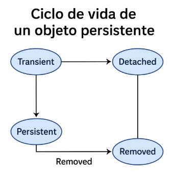

# Introducción

**El problema del desajuste objeto-relacional**

Los programas orientados a objetos (como los escritos en Kotlin o Java) utilizan **clases y objetos**, mientras que las bases de datos relacionales utilizan **tablas, filas y columnas**. Este desajuste genera **dificultades** al convertir entre ambos modelos:

- ¿Cómo representar relaciones entre objetos en tablas?
- ¿Cómo convertir un objeto con atributos complejos en un registro de base de datos?
- ¿Cómo mantener sincronizados los cambios?

Un **ORM (Object-Relational Mapping)** es una herramienta que **automatiza el proceso de mapeo** entre objetos del lenguaje de programación y tablas de la base de datos.

**Ventajas del uso de un ORM**

- ✅ Reduce la necesidad de escribir SQL manualmente
- ✅ Facilita el mantenimiento y evolución del código
- ✅ Permite trabajar directamente con objetos en el lenguaje nativo (Kotlin/Java)
- ✅ Facilita el uso de transacciones y validaciones

**Principales herramientas ORM en entornos Java/Kotlin**{.azul}

| Herramienta       | Descripción breve                                                                 |
|-------------------|-----------------------------------------------------------------------------------|
| **Hibernate**     | El ORM más popular en el ecosistema Java. Implementa la especificación JPA.       |
| **Spring Data JPA** | Extensión de Spring que simplifica aún más el trabajo con JPA mediante repositorios automáticos. Ideal para proyectos modernos con Kotlin. |

---
!!!Note ""
    **JPA** (Java Persistence API) es una especificación estándar de Java que define cómo se deben mapear objetos Java (o Kotlin) a tablas de bases de datos relacionales. Es decir, permite gestionar la persistencia de datos de forma orientada a objetos, sin necesidad de escribir SQL directamente. Para usarla necesitas una implementación, como Hibernate, EclipseLink, o Spring Data JPA.

**Ciclo de vida de un objeto persistente**{.azul}

El **ciclo de vida de un objeto persistente** describe las **etapas por las que pasa un objeto que está vinculado a una base de datos** cuando usamos una herramienta ORM (como **JPA** o **Hibernate**).

**Fases principales:**

Fase|	Descripción
----|--------------
Transient|	El objeto existe en memoria pero no está asociado a ninguna BD.
Persistent|	El objeto está asociado a una sesión/conexión y se guarda en la BD.
Detached|	El objeto estuvo asociado, pero ya no lo está (se ha cerrado la sesión).
Removed (opcional)|	El objeto está marcado para eliminarse de la BD.

1- Transient (transitorio):

- Creas el objeto con new o su constructor.
- Aún no está en la base de datos.
- Ejemplo: val prod = Producto("001", "Tornillos")

2- Persistent (persistente):

- Usas persist() o save() → el objeto se guarda en la BD.
- Está siendo seguido por el ORM.
- Cambios en el objeto se sincronizan con la BD automáticamente.

3- Detached (desvinculado):

- El objeto ya fue guardado, pero se cerró la sesión/EntityManager.
- Aún puedes usarlo en memoria, pero ya no está sincronizado con la BD.

4- Removed (eliminado):

- Se marca con remove() → está pendiente de borrarse de la BD.
- Se borra cuando se hace commit().

